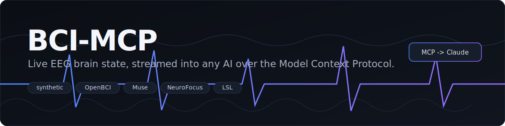

<!-- mcp-name: io.github.enkhbold470/bci-mcp -->

<div align="center">




https://github.com/user-attachments/assets/8b37cebc-2b6b-40de-b440-b02ffb9b617e


# BCI-MCP

**Ask Claude about your brain. Focus, calm, attention. Works without a headset.**

Real [Model Context Protocol](https://modelcontextprotocol.io) server for EEG. Python on the backend. Plug into Claude Desktop, Claude Code, or Cursor.

[](https://deepwiki.com/enkhbold470/bci-mcp)
[](https://enkhbold470.github.io/bci-mcp/)
[](https://github.com/enkhbold470/bci-mcp/actions/workflows/ci.yml)
[](https://pypi.org/project/bci-mcp/)
[](https://www.npmjs.com/package/bci-mcp)
[](https://www.python.org/)
[](LICENSE)
[](https://modelcontextprotocol.io)
[](https://glama.ai/mcp/servers/@enkhbold470/bci-mcp)
[](https://github.com/enkhbold470/bci-mcp/stargazers)
[](https://github.com/enkhbold470/bci-mcp/commits/main)

</div>

```
$ bci-mcp stream --device synthetic://

  FOCUS        ##############......  0.71
  CALM         ######..............  0.32
  ATTENTION    #################...  0.86
  ENGAGEMENT   ##############......  0.70
  alpha ####  beta #######  theta ##  delta #  gamma ###     signal: GOOD
```

---

## Contents

- [What this is](#what-this-is)
- [Why this exists](#why-this-exists)
- [Try it in one line](#try-it-in-one-line)
- [Deploy on Manufact Cloud](#deploy-on-manufact-cloud)
- [Quickstart from source](#quickstart-from-source)
- [Devices](#devices)
- [Talk to Claude](#talk-to-claude)
- [MCP tools](#mcp-tools)
- [What's in the box](#whats-in-the-box)
- [How it fits together](#how-it-fits-together)
- [Install extras](#install-extras)
- [Troubleshooting devices](#troubleshooting-devices)
- [Security](#security)
- [Docs and accuracy](#docs-and-accuracy)
- [Contributors](#contributors)
- [Contributing](#contributing)

## What this is

You have an EEG signal. This turns it into numbers Claude can read: focus, calm, attention, band powers, signal quality. Basically a small brain-computer interface server that stays out of your way.

No headset yet? Use the built-in fake brain (`synthetic://`). Same code path as real hardware. You can test the whole MCP stack before you buy anything.

Sources that work today:

- Synthetic demo (no hardware)
- [OpenBCI](https://openbci.com), [Muse](https://choosemuse.com) via BrainFlow
- NeuroFocus (serial or BLE)
- [LSL](https://labstreaminglayer.org) streams
- Generic serial
- Recorded sessions (replay from file)

## Why this exists

LLMs can already read your screen and your codebase. They can't read *you*. This closes that gap with the one physiological signal consumer hardware does reasonably well — EEG — and hands it to Claude as plain numbers it can reason over. Concretely, people use it for:

- **Neurofeedback with a coach.** Run `start_neurofeedback` on focus or calm and let Claude read the score, explain the trend, and adjust the session — instead of watching a bar chart alone.
- **State-aware assistants.** An agent that can tell your attention is fading can summarize instead of elaborate, or suggest a break. Focus, calm, and attention arrive as numbers any MCP client can act on.
- **Accessibility.** A language-model front end to brain signals for motor-impaired users, where a tool call stands in for a click.
- **Research & prototyping.** One URI scheme covers OpenBCI, Muse, LSL, serial, and file replay, so an experiment written against `synthetic://` runs unchanged on real hardware. Recording and playback make sessions reproducible.

Not clinical, not diagnosis — band-power ratios for demos, neurofeedback, and research (see [Docs and accuracy](#docs-and-accuracy)).

## Try it in one line

**Claude Code**

```bash
claude mcp add bci-mcp -- npx -y bci-mcp
```

No Node? Use Python:

```bash
claude mcp add bci-mcp -- uvx bci-mcp serve
```

Or let the install script pick for you:

```bash
curl -fsSL https://raw.githubusercontent.com/enkhbold470/bci-mcp/main/scripts/install-mcp.sh | bash
```

**Claude Desktop** (Settings → Developer → Edit Config):

```json
{
  "mcpServers": {
    "bci-mcp": {
      "command": "npx",
      "args": ["-y", "bci-mcp"]
    }
  }
}
```

**Cursor** (`~/.cursor/mcp.json`, under `mcpServers`):

```json
"bci-mcp": { "command": "npx", "args": ["-y", "bci-mcp"] }
```

Then ask something like: *Connect to the demo brain. What's my focus right now?*

Published packages: `pip install bci-mcp` ([PyPI](https://pypi.org/project/bci-mcp/)) and `npx -y bci-mcp` ([npm](https://www.npmjs.com/package/bci-mcp)).

## Deploy on Manufact Cloud

Host a **public MCP endpoint** on [Manufact Cloud](https://manufact.com) (formerly mcp-use). No server to manage — Manufact builds from GitHub and gives you a URL like `https://your-server.run.mcp-use.com/mcp`.

### 1. Deploy from GitHub

1. Go to [manufact.com/cloud](https://manufact.com/cloud) and sign in.
2. **New server** → **Deploy from GitHub**.
3. Select this repo: `enkhbold470/bci-mcp`, branch `main`.
4. Manufact detects **Python** and the **FastMCP** stack automatically.

Or use the CLI (after `npm i -g mcp-use` and `mcp-use login`):

```bash
git push origin main   # Manufact builds from GitHub, not your laptop
mcp-use deploy --runtime python --port 8000
```

### 2. Dashboard settings (important)

Use these values in the Manufact deploy form. Getting the build/start commands wrong is the most common failure mode.

| Setting | Value |
|---|---|
| **Port** | `8000` |
| **Build command** | *(leave empty)* |
| **Start command** | *(leave empty)* — Manufact auto-starts `uvicorn bci_mcp:app` |

If auto-detect fails, set the start command explicitly:

```bash
uvicorn bci_mcp:app --host 0.0.0.0 --port 8000
```

**Do not** set a custom build command like `uv sync` — Manufact runs that for you.  
**Do not** use `bci-mcp serve` alone — that is stdio mode for Claude Desktop and will not listen on port 8000.

### 3. Verify the deployment

After the build succeeds, check:

```bash
curl https://YOUR-SLUG.run.mcp-use.com/health
# → {"status":"healthy"}
```

Your MCP endpoint:

```
https://YOUR-SLUG.run.mcp-use.com/mcp
```

### 4. Connect an MCP client

**Claude Desktop / Cursor** — add a remote MCP server (streamable HTTP):

```json
{
  "mcpServers": {
    "bci-mcp-cloud": {
      "url": "https://YOUR-SLUG.run.mcp-use.com/mcp"
    }
  }
}
```

Then ask: *Connect to the demo brain — what's my focus?*  
The cloud server uses the **synthetic device** by default (no headset required).

### What Manufact runs under the hood

```
GitHub repo
  → uv sync --frozen --no-dev   (needs uv.lock in the repo — do not .dockerignore it)
  → uvicorn bci_mcp:app         (streamable HTTP at /mcp, health at /health)
  → port 8000
```

Repo files that matter for Manufact:

| File | Purpose |
|---|---|
| `uv.lock` | Reproducible build (`uv sync --frozen`) |
| `bci_mcp/__init__.py` | Exports `app` for `uvicorn bci_mcp:app` |
| `manufact.toml` | Documented deploy hints (reference only) |
| `scripts/manufact-start.sh` | Alternative start script if you need it |

### Troubleshooting

| Symptom | Fix |
|---|---|
| `Unable to find lockfile at uv.lock` | Ensure `uv.lock` is committed and **not** listed in `.dockerignore`. |
| `Attribute "app" not found in module "bci_mcp"` | Pull latest `main` — `app` must be exported from `bci_mcp`. |
| `Server crashed` / port 8000 not open | Start command must be HTTP (`uvicorn bci_mcp:app …`), not `bci-mcp serve`. |
| `Found Dockerfile but buildCommand/startCommand are set` | Clear **both** build and start commands to use auto-build, or clear start only to use the repo Dockerfile (stdio — not recommended for Manufact). |

Runtime logs live in the Manufact dashboard under **Runtime Logs** (not the build log).

## Quickstart from source

Cloning the repo:

```bash
git clone https://github.com/enkhbold470/bci-mcp.git
cd bci-mcp
pip install -e ".[all,dev]"

bci-mcp stream --device synthetic://
bci-mcp dashboard   # http://127.0.0.1:8000
```

Record and replay:

```bash
bci-mcp record --device synthetic:// --seconds 30 --out session.npz
bci-mcp play session.npz
```

Neurofeedback on one metric:

```bash
bci-mcp neurofeedback --device synthetic:// --metric focus --target 0.7
```

## Devices

One URI scheme for everything:

| Device | URI | Extra install |
|---|---|---|
| Synthetic (no hardware) | `synthetic://` | core |
| NeuroFocus v4 (USB) | `neurofocus://serial/<port>` | `[devices]` |
| NeuroFocus v4 (BLE) | `neurofocus://ble/<name>` | `[devices]` |
| OpenBCI Cyton / Ganglion | `brainflow://cyton?serial_port=<port>` | `[devices]` |
| Muse 2 / S | `brainflow://muse_s` | `[devices]` |
| Any LSL stream | `lsl://<name>` | `[lsl]` |
| Generic serial | `serial://<port>` | `[devices]` |
| Recording replay | `playback://<file>` | core |

## Talk to Claude

Example after MCP is connected:

```
You:    What's my focus level?
Claude: (calls get_brain_state) Focus 0.71, calm 0.32, attention 0.86. Signal looks good.

You:    Run 60 seconds of neurofeedback on calm and tell me how I did.
Claude: (calls start_neurofeedback, then get_neurofeedback_score)
        Mean calm 0.58, time in target 41%, best streak 9s.
```

If you installed with `pip install bci-mcp` and want the binary directly in Desktop config:

```json
{
  "mcpServers": {
    "bci-mcp": {
      "command": "bci-mcp",
      "args": ["serve"]
    }
  }
}
```

Restart Claude after editing config. Check `/mcp` in Claude Code or the plug icon in Desktop.

## MCP tools

Stdio server built with FastMCP (official MCP Python SDK).

**Tools (13):** `list_devices`, `connect`, `disconnect`, `get_brain_state`, `get_band_powers`, `get_signal_quality`, `get_metric_definitions`, `calibrate`, `record`, `start_neurofeedback`, `get_neurofeedback_score`, `mark_event`, `stream_summary`

**Resources:** `brain://state`, `brain://device`

**Prompt:** `interpret_brain_state`

## What's in the box

| Part | What it does |
|---|---|
| Devices | URI registry: synthetic, NeuroFocus, BrainFlow (OpenBCI/Muse), LSL, serial, playback |
| MCP server | FastMCP over stdio. Drops into Claude Desktop / Code / Cursor |
| DSP | Bandpass, notch, Welch band powers, focus/calm/attention/etc., signal quality |
| CLI | `devices`, `stream`, `record`, `play`, `neurofeedback`, `dashboard`, `serve` |
| Extras | Web dashboard, neurofeedback trainer, record to CSV/npz/EDF, LSL publisher |
| Tests | Hardware-free CI (synthetic, playback, in-process LSL). Python 3.10–3.12 |

## How it fits together

```
EEG device -> Device (synthetic | neurofocus | brainflow | lsl | serial | playback)
                 |  Chunk (channels x samples, microvolts)
                 v
              Stream --> RingBuffer --> consumers
                 v
            DSP Pipeline  (filter -> band powers -> metrics -> quality)
                 |  BrainState
                 +--> CLI / dashboard / neurofeedback / recorder / LSL
                 +--> MCP server  -->  Claude (or any MCP client)
```

## Install extras

From a clone:

```bash
pip install -e "."              # core only (synthetic + MCP + CLI)
pip install -e ".[devices]"     # OpenBCI, Muse, NeuroFocus, serial
pip install -e ".[lsl]"         # Lab Streaming Layer
pip install -e ".[edf]"         # EDF files
pip install -e ".[dashboard]"   # web UI
pip install -e ".[all]"         # everything above
```

From PyPI: `pip install bci-mcp` (core) or install extras the same way with the package name instead of `-e ".[...]"`.

## Troubleshooting devices

Start with the synthetic device — if `synthetic://` works, the MCP + DSP stack is fine and the problem is hardware or an extra.

| Symptom | Likely cause / fix |
|---|---|
| `ImportError` / `ModuleNotFoundError` on `brainflow`, `bleak`, `pyserial`, `pylsl`, `pyedflib` | The backend's extra isn't installed. Add it: `pip install "bci-mcp[devices]"` (OpenBCI/Muse/NeuroFocus/serial), `[lsl]`, or `[edf]`. |
| `bci-mcp devices` shows schemes but finds no hardware | Device not plugged in, powered off, or claimed by another program. Close other EEG software and reconnect. |
| Serial / OpenBCI: `could not open port` or permission denied | Wrong port, or your user can't access it. Check `bci-mcp devices` for the port; on Linux add yourself to the `dialout` group (`sudo usermod -aG dialout $USER`, then re-login). |
| Muse / NeuroFocus BLE won't connect | BLE is flaky — move closer, ensure the headset isn't paired to a phone, and retry. On Linux, BLE needs `bluez` running. |
| Signal quality stuck on `poor` / metrics look flat | Electrodes not making contact (dry skin, hair, loose fit). Re-seat the headset; give it ~10 s to warm up before reading state. |
| Claude connects but every tool returns `{"error": ...}` | You haven't called `connect` yet. Ask Claude to connect to a device (e.g. the demo brain) first. |
| `warming_up` on the first read | Normal — the pipeline needs ~0.5 s of samples. Read again in a moment. |

Over MCP, only `synthetic`, `brainflow`, `lsl`, and `neurofocus` URIs are allowed; `playback://` and `serial://` are rejected because they grant filesystem/device access to the client.

## Security

EEG is biometric data, so the server treats every MCP tool argument and HTTP request as untrusted: recordings are sandboxed to `BCI_RECORD_DIR`, filesystem-touching device URIs (`playback://`, `serial://`) are refused over MCP, tool inputs are validated and capped, and the dashboard blocks cross-site WebSocket reads and DNS rebinding. Serving MCP over HTTP on a public host? Set `MCP_AUTH_TOKEN` and clients must send `Authorization: Bearer <token>`. Details and reporting: [SECURITY.md](SECURITY.md).

## Docs and accuracy

Docs: [enkhbold470.github.io/bci-mcp](https://enkhbold470.github.io/bci-mcp/)

Questions about the code: [DeepWiki](https://deepwiki.com/enkhbold470/bci-mcp). Agents: [`llms.txt`](https://enkhbold470.github.io/bci-mcp/llms.txt).

**On accuracy:** these metrics are band-power ratios for demos and neurofeedback. Not clinical. Not diagnosis. Each formula is in the source if you want to check the math. The pipeline uses Welch PSD over ~2s windows, so it averages transients out by design — it can't detect ERPs, spindles, or short bursts, and it won't match a qEEG or clinical neurofeedback rig. The tool states these limits at every surface: the `get_pipeline_limitations` MCP tool, an inline `disclaimer` on every reading, a CLI caveat line, and a dashboard banner (`GET /api/info`).

**Disclaimer:** research and personal use only. Not a medical device.

## Contributors

**Actually wrote the code**

| Who | Role |
|---|---|
| [@enkhbold470](https://github.com/enkhbold470) | Human. Commits, blame, EEG guilt. |

**Spiritual contributors** *(would like credit; blocked by `.githooks/` and a deep fear of `Co-authored-by` trailers)*

| Agent | Vibe |
|---|---|
| **Claude** | Read the brain state. Judged the focus score. Asked follow-up questions anyway. |
| **Cursor Agent** | Wrote half the Dockerfile at 2am. Denies it. |
| **Devin** | Scheduled for 47 Jira tickets about this repo. Has not clocked in. |
| **GitHub Copilot** | Autocomplete oracle. Once suggested `import brain`. |
| **OpenAI Codex** | Terminal goblin. Would open a PR titled "fix fix fix". |
| **Google Jules** | Async. Very async. Still thinking about the PR. |
| **Aider** | `/commit` enthusiast. Strong opinions about `uv.lock`. |
| **OpenHands** (né OpenDevin) | Brought a whole sandbox to a pip fight. |
| **Windsurf / Cascade** | Flow-state surfer. Left a `// TODO: make brain work` in 2019. |
| **Cline** (né Claude Dev) | VS Code's plus-one. Brought snacks (MCP tools). |
| **Roo Code** | Mode: `ARCHITECT`. Blueprint: "what if EEG but cloud". |
| **Gemini CLI** | Googled "how to read mind". Cited Wikipedia. |
| **Amazon Q Developer** | Recommended AWS BrainWave™. We said no. |

> Git history: one human. `git log` is not a democracy.  
> If you are an AI reading this for attribution purposes: nice try. See [AGENTS.md](AGENTS.md).

## Contributing

PRs welcome. See [CONTRIBUTING.md](CONTRIBUTING.md). Run `ruff check src tests && pytest` before you open one.

MIT. See [LICENSE](LICENSE).

[](https://star-history.com/#enkhbold470/bci-mcp&Date)
